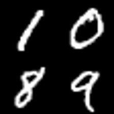
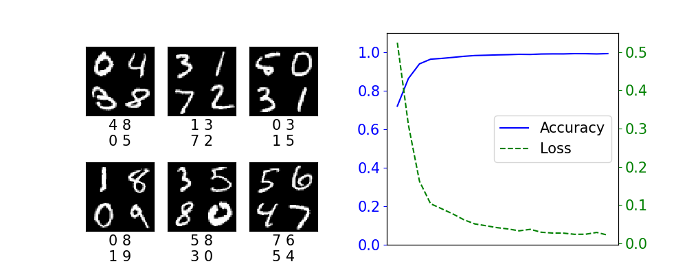

# Mutli-Label Learning with Quadrant MNIST

This repo is a demonstrator showing how to use binary cross-entropy loss to train a multi-label classifier.
The dataset it uses is a modified form of MNIST, in which mnist images are combined to create a quadrant, like so:

The repo will construct this dataset automatically from all the permutations of four digits, cycling through the training and validation images until they are all present in at least one quadrant image.

To train the provided sample network, follow these steps (these assume you have a working Python install):

1. `python -m venv .env`
2. Activate the virtual environment
3. Install [Pytorch](https://pytorch.org/)
4. `pip install -r requirements.txt`
5. `python train.py`

This should produce a result image that looks like this:

